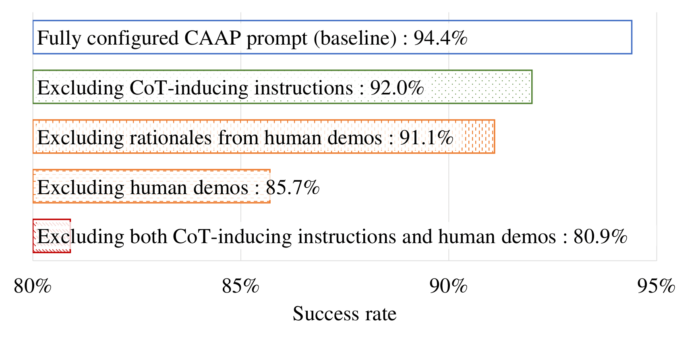
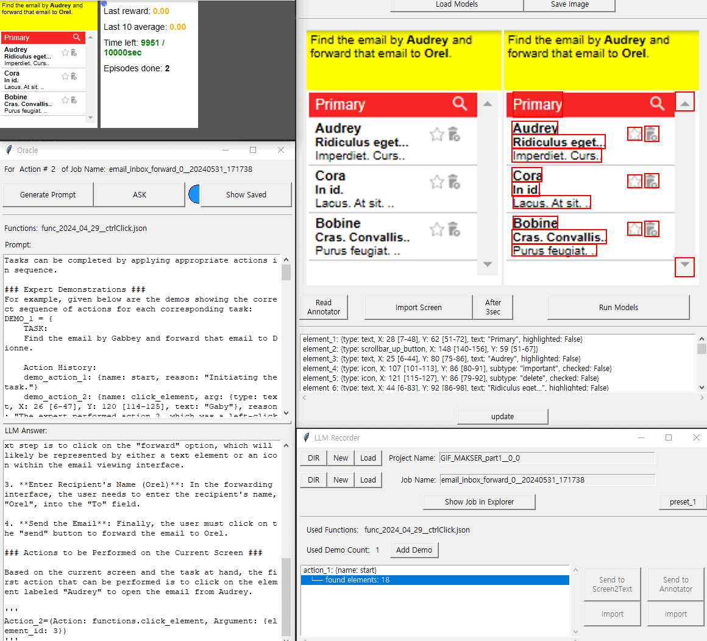

# CAAP: Context-Aware Action Planning Prompting to Solve Computer Tasks with Front-End UI Only

<p align="center">

<p align="center">
The effects of different CAAP components on MiniWoB++ task performance.

***
## Introduction
This repository contains code for the Front-End UI Agents for Computer Tasks using CAAP prompting to be used in MiniWoB++.
This README.md file provides an overview of the repository and instructions for using the code.

***
## Getting Started
### Prerequisites
```python
git clone https://github.com/caap-agent/caap-agent.git
cd caap-agent
# requirements was created at Pyhon 3.9.13
python -m pip install -r requirements.txt
```

***
### Download saved checkpoints
- ../saved_checkpoint [file location example](#directory-tree)  
Download the checkpoint folder through this [**link**](https://drive.google.com/file/d/1kciKPCgYeFrMNn7_Z7t4kkjMqaMyvEZL/view?usp=drive_link) and unzip it, placing it in the parent folder.

***
### Fill in the Credential information
- ../.credentials.json with the following format json [file location example](#directory-tree)
```
{
    "OPENAI_API_BASE": <YOUR_OPENAPI_API_BASE>,
    "OPENAI_API_KEY": <YOUR_OPENAPI_API_KEY>,
    "OPENAI_API_TYPE": "azure",
    "OPENAI_API_VERSION": "2024-02-15-preview",
    "OPENAI_API_ENGINE_GPT4": "gpt-4-0125-preview",
    "OPENAI_API_ENGINE_GPT3": "gpt-35-turbo-v1106",
    "HTTP_PROXY": <HTTP_PROXY>, # optional
    "HTTPS_PROXY": <HTTPS_PROXY>, # optional
    "NO_PROXY": "", # optional
    "REQUESTS_CA_BUNDLE": "", # optional

}
```

- OPENAI_API_BASE : Base path of Azure OpenAI API
- OPENAI_API_KEY : Secret Key of Azure OpenAI API

Even if you habe entered the correct information, if it is not working,
Please modify 2 points, according to your own environments, it may vary.
1. 355th line of src>supports>caap_prompter_support.py 'openai.ChatCompletion.create'
2. 451th line of src>supports>demo_scripter_support.py 'openai.ChatCompletion.create'


***
***
## How to Use
### Quick Start
```python
python3 main_controller.py
```
* Click 'RUN' button on the 'Main Controller' window.

***

<p align="center">


<p align="center">
CAAP Agent Demonstration about sampled tasks

***
### Comprehensive Guide
#### Directory tree
```
├── saved_checkpoint
│   ├── commentator
│   ├── detectors
├── caap-agent
│   ├── breakdown_modules
│   ├── data
│   ├── DOM_conversion_rules
│   ├── functions
│   ├── src
│   │   ├── supports
│   │   ├── utils
│   │   ├── *.py
│   ├── main_controller.py
│   ├── README.md
│   ├── required_modules.txt
│   ├── requirements.txt
│   ├── run_config.py
│   ├── .gitignore
└── .credentials.json
```


- breakdown_modules : Breakdown module for special element.
- data : Human demo, scripts and agent execution results data storage.
- DOM_conversion_rules : Converters that transforms MiniWoB++ environment's DOM information can occasionally be helpful.
- functions : Specification for the 'action' for ChatGPT function-calling
- src : 
    - supports : The module names below match 1:1 with corresponding support files,<br>&nbsp;&nbsp;&nbsp;&nbsp;&nbsp;&nbsp;&nbsp;&nbsp;&nbsp;&nbsp;&nbsp;&nbsp;&nbsp;&nbsp;&nbsp;&nbsp;with the naming convention being the filename + \_support.
    - annotator.py : Annotator for Visual Oberver
    - caap_prompter.py : CAAP prompter
    - demo_recoder.py : a module that saves inputs executed by human to the environment in a way that LLMs can understand.
    - dome_scripter.py : Converting Human demo record into demo scripter.
    - llm_recoder.py : It adds human demonstrations suitable for the task and performs the role of Decision Maker and Action Controller.
    - virtual_miniwob.py : It runs the MiniWoB++ in virtual mode and displays the DOM information on the screen. The displayed information can be used in the annotator.
    - visual_observer.py : Extracting visual elements from a screenshot and describing them in natural language.
- main_controller.py : Controlling and managing all windows.
- run_config.py : Writing specifications for automatic execution, and when the 'RUN' button of the main controller is pressed, it operates according to the specifications.
- required_modules.txt : This file contains a list of Python modules that must be installed in order to run this project successfully.


#### Let's go through the steps of how it works when the "**Run**" button on the **Main Controller** is pressed.
1. Run main_controller.py 
2. Click '**LLM Recorder**' button on the **Main Controller**.
3. Click the first '**New**' button at the top of the **LLM Recorder**.
4. Click the second '**New**' button at the top of the **LLM Recorder**.
5. If there is/are a demo(s) performed by a person in the same environment with a different seed, add it/them.<br>
(optional) Click the '**Add Demo**' button on the **LLM Recorder**.
6. Click the '**Send to VirsualObserver**' button on the **LLM Recorder**.
7. Click the '**refresh list**' on the **Visual Observer**.
8. Click the '**Load Models**' on the **Visual Observer**.
9. Click the '**Run Models**' on the **Visual Observer**.
10. Click the '**Import**' button below 'Send to VisualObserver' on the **LLM Recorder**.
11. Click the '**Send to Oracle**' button on the **LLM Recorder**.
12. Click the '**ASK**' button on the **Prompter**.
13. Click the '**ACT**' button on the **LLM Recorder**.<br>
(Exceptionally, for the 'choose-list' task, press the 'Act from the Top' button on the **LLM Recorder**.)
14. Repeat steps 6 to 13 until successful.

> ## **NOTE**
>* Do not click on other windows while the MiniWoB++ window is open.
>Pressing another window while the window is open will cause the other window to be mistaken for a MiniWoB++ window.
>* The models required for the Visual Observer are supposed to run on the CPU, so it may be slow depending on the environment. If necessary, Please check the src>supports>screen_commentator.py file and use a GPU or other technology to improve speed.

***
***
## License
[License](LICENSE)
